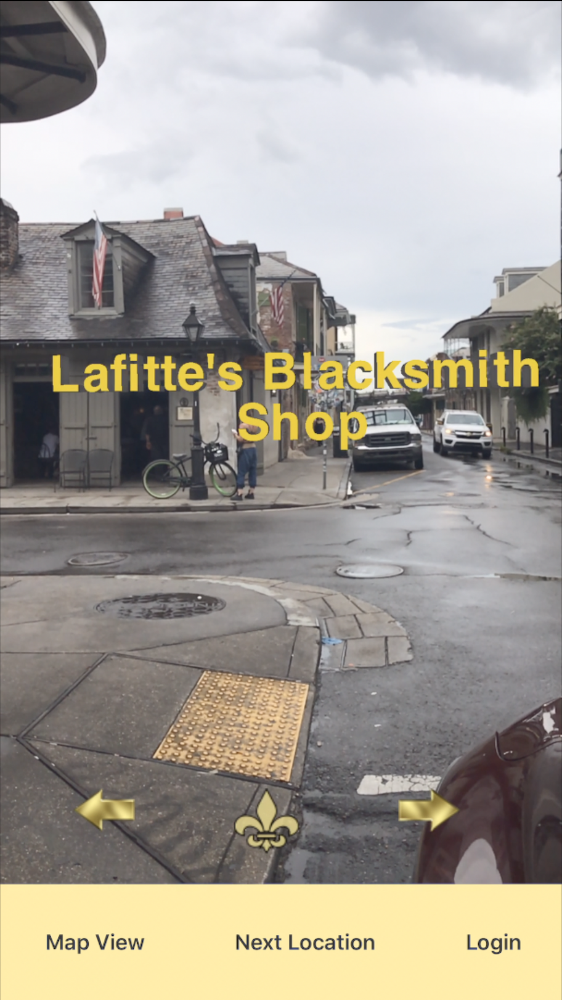

<<<<<<< HEAD

# AR History Tour
Use augmented reality to discover facts about your city.
## Table of Contents

1. [How it works](#how-it-works)
2. [On Location](#On-Location)
3. [Database](#database)
4. [Tech Stack](#tech-stack)
5. [Development](#development)
    1. [System Requirements](#system-requirements) 
    2. [Installation](#installation)
6. [Running Tests](#tests)
7. [Deployment](#deployment)
8. [Authors](#authors)
9. [Acknowledgments](#acknowledgments)
## How It Works
A fun way to explore the city around you! With an ARkit or ARcore enabled smartphone, go on an augmented reality tour of your local points of interest.
With a minimal interface, the focus stays on the area around you, while a click of a button will bring 3 dimensional text information into view, rooted to the area around you.
Easily switch to a map view, and get a view of what else is around you that you may want to explore. Sign up, save your favorite places, and see those saved locations on a favorites map.

## <a name="On-Location"></a>On Location
<div>


</ div>
<div>


</ div>
<div>


</ div>
<div>


</ div>


## <a name="Database"></a>Database


## <a name="tech-stack"></a>Tech Stack


## <a name="development"></a>Development
Setting up a development environment requires global installations of node
## <a name="system-requirements"></a>System Requirements
* Node 8
* ARKit enabled Smartphone
* ViroMedia App
* SQL database

## <a name="installation"></a>Installation
```sh
$ git clone https://github.com/LANsharkCryptoAnalytics/LANshark.git
$ cd LANshark/
$ yarn install
$ yarn start // this starts the client server
$ yarn server // this starts the node server (have both client and node server running simutaneously)
On your iPhone Download Viro Media from App store.
Once Viro Media has finished downloading open app
Click the menu button in the top left corner
Click "Enter TestBed"
Enter your machine's local IP address into Viro Media's Test Bed
Click "Go" button
```

## <a name="tests"></a>Running Tests
$ yarn test

## Deployment
```sh
It will require two independent servers to deploy this application,
one for the client/front-end and one for the back end.
 * Front end: clone the repo onto your server run "yarn install".
   Create an .env file and place the environmental variables into it.
    Run the server with the "yarn start" script
 * Back end server: Configure a server with Node.js 10.0, clone the project
  repo into it and run "yarn  install". Create a .env file with api-keys and
  environemental variables in the root file of the server
 * This application requires the Viro Media test bed app, which may be downloaded
  from the Apple App store for free. After it has been installed and loaded, enter the address of the front-end server to connect the app.
```


## <a name="authors"></a> Authors
- Alec Gilchrist
- Josef Butts
- Senai Ayalew
- Joshua Blankenship

## <a name="acknowledgments"></a>Acknowledgments
Big thanks to The Wikimedia Foundation, ViroReact, and Opspark
=======
# LANshark
Thesis Project
## <a name="tech-stack"></a>Tech Stack

>>>>>>> cd56892cfdac80a429260352df14fa7116d6a59f
